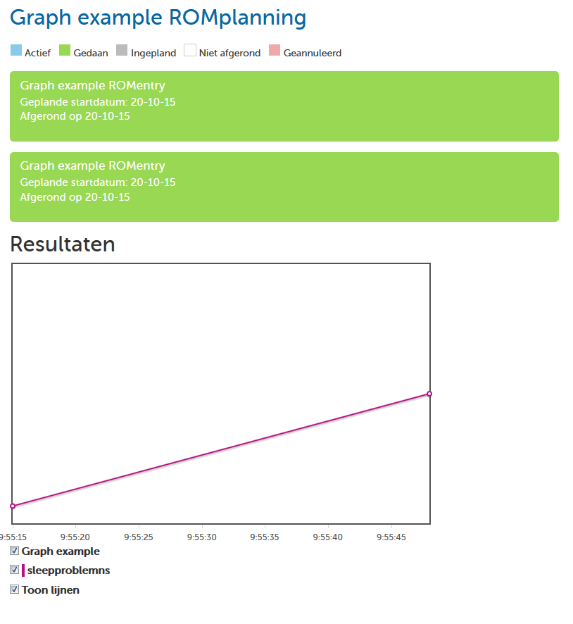

In this folder you can see the example for the basic graph on Github.

You can make a graph by using the variables you made in the computation, or
from data of the questions in the questionnaire. If you know which data you
want to graph, follow this step-by-step guide:

1. Open your graph by typing `var graph = function graph (data, computation)`
2. Initialize the return variable example `var result;`
3. Give the return variable an initial value `result = [];`
4. Then we start "pushing" graph points in this return variable, which is an
   array. We do that by adding objects to the result array, each object
   defines one graph line:  `result.push({...});`
5. The value for "label" will be the name of the line of your graph. You and
   the client will see this under the graph.
6. In "max" put the maximum value of the Y-axis for this variable.
7. In "value" put the name of the variable you want to use. This can be a
   field value or a computation result. For a field value use something like
   `data.q10`. For a computation value you can use `computation.sleep` for
   example.
8. Then return the result.

If you want to test your graph, please put your document in a ROMentry and the
ROMentry in a ROMplanning like you learned during the CMS training.  Make the
monitoring (your ROMplanning) available for your testclient at twice (can be
on the same day), and fill it in (you can see the results the best if you
respond differently each time).  If all went well, you will get a graph like
this:

